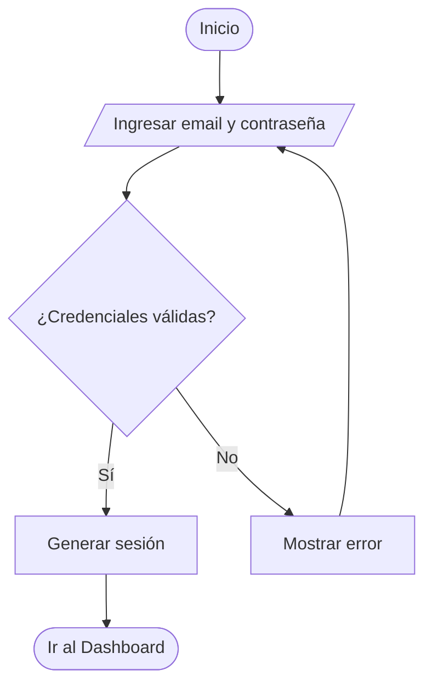

[← Volver al flujo general](../README.md)

# Flujo de Login

```mermaid
flowchart TD
    A([Inicio]) --> B[/Ingresar email y contraseña/]
    B --> C{¿Credenciales válidas?}
    C -- Sí --> D[Generar sesión]
    D --> E([Ir al Dashboard])
    C -- No --> F[Mostrar error]
    F --> B
```
